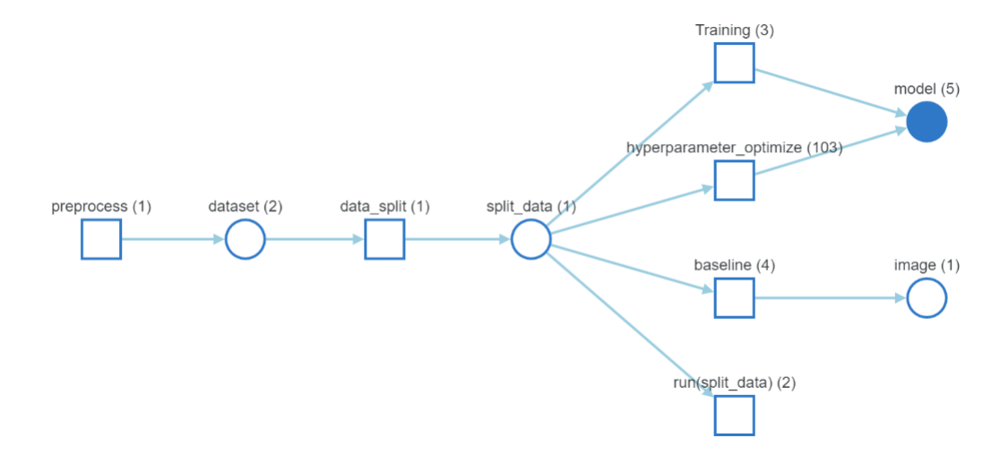

# Queries Classifier

In this project we are going to classify customer queries based on their intentions. To get the data please use below link [here](#https://huggingface.co/datasets/banking77).
We are going to use different types of **BERT** models and **Weights and Biases** for model monitoring and tracking the performance

## 🔑 Approach

In this project we are going to approach this problem by following below steps

1. EDA using **Spacy**
2. Preprocessing data using Pandas and tf.data
3. Spliting data into train,test,valid set 
4. Baseline **BERT** model
5. Hyperparameter optimization using W&B Sweeps
6. Finalising **BERT** model by performance
7. Evaluting a model on Test set
8. Publish report in **W&B**

## Model WORKFLOW

**NOTE:** The graph is generated by Weights and Biases

## 📑Reports

Used Weights and Biases to generate reports by monitoring model performance

[Text classifier using BERT model](https://wandb.ai/basha/banking_77/reports/Text-classification-using-BERT-models--VmlldzoyMzYyODc0?accessToken=4k5yott9og227f8r8hjnovntvnw571j2vj686me9phc43nvgad958akz7np6zgn8)
